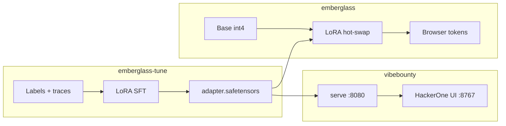

# Architecture

Three sibling repos at `~/`:

| Path | GitHub | Job |
|---|---|---|
| `~/emberglass/` | [qwen-webgpu-lora](https://github.com/maceip/qwen-webgpu-lora) | WebGPU **inference** |
| `~/emberglass-tune/` | [emberglass-tune](https://github.com/maceip/emberglass-tune) | LoRA **training** |
| `~/vibebounty/` | [vibebounty](https://github.com/maceip/vibebounty) | Bug-bounty **demo** |

**Training details:** [emberglass-tune README](https://github.com/maceip/emberglass-tune) — MLX path, CUDA path, Anthropic teacher/judge trace pipeline.

**This repo (emberglass)** implements forward-pass WebGPU only. See root [README](../README.md).
